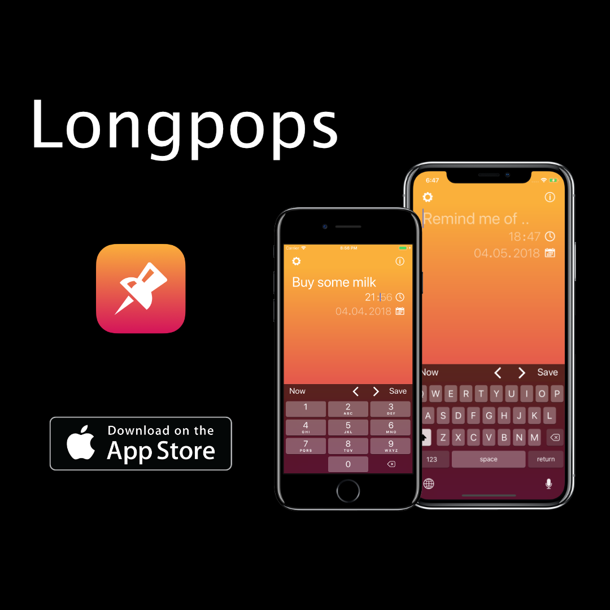

## Longpops for iOS

Longpops is meant to be a fast way to create overdue Reminer items, that remain on your lockscreen until they are marked as completed. 

[See it in video.](https://youtu.be/FaXg3InmyCg)

[Download Longpops on the App Store!](https://itunes.apple.com/us/app/longpops/id1315774305?mt=8)
